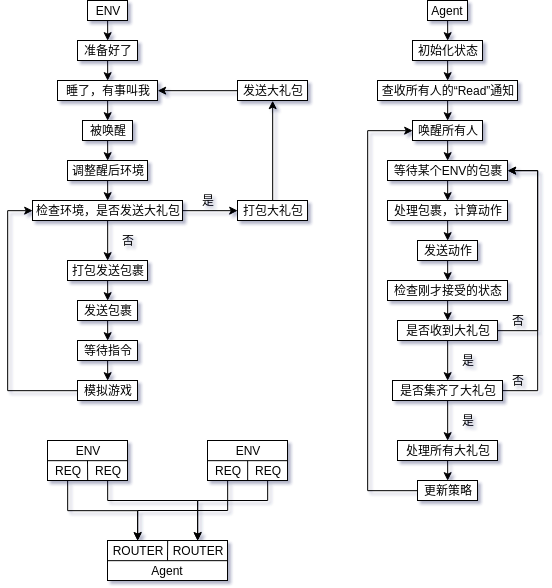

# RL-Algo
工作流程文档：[链接](https://docs.google.com/document/d/1JHuQaDlghXzIX-O2iSxKlCoToozOPBYTZrWt8PbxY98/edit?usp=sharing)

<!-- TOC depthFrom:1 depthTo:6 withLinks:1 updateOnSave:1 orderedList:0 -->
- [RL-Algo](#rl-algo)
	- [交互框架](#交互框架)
		- [环境和Agent](#环境和agent)
	- [算法涵盖](#算法涵盖)
		- [代码组成](#代码组成)
	- [代码主要部分](#代码主要部分)
	- [Estimator主要部分](#estimator主要部分)
	- [信息传递流程图](#信息传递流程图)
<!-- /TOC -->

## Result of SpaceInvaders


## 交互框架
### 环境和Agent
一个玩家同时和多个环境进行交互，从多个环境处收集数据进行训练。

## 算法涵盖
- DQN
- DoubleDQN
- SoftDQN
- AveDQN
- DistDQN
- PG
- A2C
- TRPO
- PPO
- DDPG

运行算法：
```bash
python main.py --env "Reacher-v2" --model ppo
```

额外的参数
- `result_path`：模型和结果存储路径。
- `batch_size`：batch size。
- `memory_size`：存储中间操作的大小。
- `lr`：学习率。
- `n_env`：多少个env并行。
- `n_action`：actiond的数目（离散动作）。
- `dim_action`：action维数（连续动作）。
- `dim_ob`：observation的维数。
- `discount`：discount。
- `n_step`：每次和环境交互的步数。
- `save_model_every`：多久保存一次模型。
- `update_target_every`：多久更新一次target模型。

## 代码组成
### 代码主要部分
- Estimator：构建算法，包括搭建网络，更新策略。
- Middleware：存取交互数据；负责通信。
- Environment：包装游戏环境（主要是gym），即step-reset这种离散模式。

### Estimator主要部分
- `build_model`
构建算法迭代更新中的基本tensorflow操作：loss；state_value；等等。

- `update`
使用`build_model`中的tensorflow模块更新算法。这一阶段大量调用`sess.run`，但不会使用tensorflow搭建模块。

- `get_action`
根据obsevation得到下一个动作。

## 信息传递流程图


